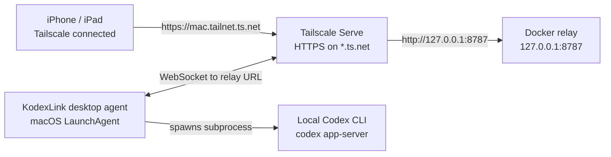

# Tailscale Private Relay Setup

This guide configures KodexLink so the relay runs on this Mac in Docker while
Tailscale Serve publishes it privately to devices in the tailnet.

## Table of Contents

- [Target Architecture](#target-architecture)
- [Serve Versus Exit Node](#serve-versus-exit-node)
- [Why Tailscale Serve](#why-tailscale-serve)
- [Tailscale Admin Setup](#tailscale-admin-setup)
- [Tailscale CLI Setup](#tailscale-cli-setup)
- [Mac Setup](#mac-setup)
- [iPhone And iPad Setup](#iphone-and-ipad-setup)
- [Optional Exit Node](#optional-exit-node)
- [Verification](#verification)
- [Troubleshooting](#troubleshooting)
- [References](#references)

## Target Architecture



The relay does not own TLS. Tailscale Serve terminates HTTPS and proxies to the
plain HTTP relay on localhost.

## Serve Versus Exit Node

Tailscale Serve is the required feature for this setup. It makes one local
service reachable inside the tailnet.

An exit node is not required for KodexLink remote access. Use an exit node only
if you also want the iPhone or iPad to route general internet traffic through
home.

## Why Tailscale Serve

Tailscale being connected on the Mac does not automatically publish local Mac
ports. It puts the Mac and phone on the same private tailnet.

The Docker relay intentionally binds to:

```text
127.0.0.1:8787
```

That address is private to the Mac. From the iPhone, `127.0.0.1` means the
iPhone itself, not the Mac.

Binding Docker to `0.0.0.0` or to the Mac's Tailscale interface would make the
relay reachable as plain HTTP. The mobile app should use a normal OS-trusted
HTTPS endpoint for remote access.

Tailscale Serve provides that private HTTPS proxy:

```text
https://machine-name.tailnet-name.ts.net -> http://127.0.0.1:8787
```

or, when host port `443` is already needed by another local service:

```text
https://machine-name.tailnet-name.ts.net:8443 -> http://127.0.0.1:8787
```

No router ports are opened and no separate certificate renewal process is needed
for this setup.

## Tailscale Admin Setup

Use a Tailscale account with Owner, Admin, or IT admin rights.

1. Open [Tailscale DNS settings](https://login.tailscale.com/admin/dns).
2. Enable MagicDNS if it is not already enabled.
3. Enable HTTPS certificates.
4. Confirm the certificate transparency warning.
5. Note the tailnet DNS name, for example `example-name.ts.net`.
6. Open [Tailscale Machines](https://login.tailscale.com/admin/machines).
7. Select the Mac that will run KodexLink.
8. Rename the machine first if its name is sensitive. The final HTTPS name can
   appear in certificate transparency logs.
9. After Serve is running, check that the machine has a valid certificate
   status.

Do not run `tailscale cert` for this setup. Tailscale Serve manages the HTTPS
certificate path automatically.

## Tailscale CLI Setup

The App Store variant of Tailscale does not always install a `tailscale`
launcher into `PATH`. This project installs a wrapper at:

```text
/usr/local/bin/tailscale
```

The wrapper runs:

```text
/Applications/Tailscale.app/Contents/MacOS/Tailscale
```

Install or refresh it with:

```bash
make install-tailscale-cli
```

Verify:

```bash
command -v tailscale
tailscale version
tailscale status
tailscale serve status
```

These direct `tailscale` commands are verification commands. For normal setup
and daily use, prefer the Makefile workflow. `make enable` already runs the
needed Tailscale Serve command with the saved settings from `relay.env`.

`tailscale status --json` reports the machine DNS name in `Self.DNSName`. The
value looks like this and can include a trailing dot:

```text
machine-name.tailnet-name.ts.net.
```

Use the DNS name without the trailing dot when configuring KodexLink:

```text
https://machine-name.tailnet-name.ts.net
```

## Mac Setup

Install and log in to Tailscale on the Mac. Then run:

```bash
make install PUBLIC_URL=https://machine-name.tailnet-name.ts.net
make enable
make doctor
```

That Makefile flow is the supported setup path. The lower-level `tailscale
serve` command shown later is only the equivalent underlying operation, useful
for understanding the setup or for troubleshooting.

`make install` creates the private env file outside the repository:

```text
~/.config/kodexlink-tools/relay.env
```

That file is the supported configuration source for this setup. The most useful
keys are:

- `KODEXLINK_RELAY_PUBLIC_BASE_URL` for the mobile-facing HTTPS URL.
- `KODEXLINK_TAILSCALE_HTTPS_PORT` for the shared published Tailscale
  Serve/Funnel HTTPS port. Valid values are `443`, `8443`, or `10000`.
- `KODEXLINK_RELAY_HOST_PORT` for the local Docker port only.

Do not edit the KodexLink LaunchAgent plist to change relay URL or port. The
LaunchAgent only restarts the desktop agent process; it does not own relay
network settings.

`make enable` starts the Docker relay stack, configures Tailscale Serve, and
installs the KodexLink desktop LaunchAgent.

The project Serve command maps:

```text
https://machine-name.tailnet-name.ts.net -> http://127.0.0.1:8787
```

The equivalent lower-level commands are:

```bash
./scripts/kodexlink-relay.sh set-public-url https://machine-name.tailnet-name.ts.net
./scripts/kodexlink-relay.sh restart
./scripts/kodexlink-relay.sh tailscale-serve
```

To publish on `8443` instead of `443`:

```bash
make configure-https-port HTTPS_PORT=8443
make configure-url PUBLIC_URL=https://machine-name.tailnet-name.ts.net:8443
make enable
```

Prefer `make install`, `make enable`, and `make doctor` for normal operation.
Only drop to the lower-level commands when debugging or when you intentionally
need to inspect the exact Tailscale step.

## iPhone And iPad Setup

1. Install Tailscale on iPhone or iPad.
1. Log in to the same tailnet.
1. Make sure Tailscale is connected.
1. Visit `https://machine-name.tailnet-name.ts.net/healthz` in Safari. It should
   return a JSON health response.
1. If you intentionally published on `8443`, visit
   `https://machine-name.tailnet-name.ts.net:8443/healthz` instead.
1. Open KodexLink.
1. Open Settings.
1. Open Relay Server.
1. In Relay Environment, select Custom Address.
1. Enter the Tailscale HTTPS relay URL:

   ```text
   https://machine-name.tailnet-name.ts.net
   ```

   If you intentionally published on `8443`, enter:

   ```text
   https://machine-name.tailnet-name.ts.net:8443
   ```

1. Tap Save Custom Address.
1. Return to the pairing scanner.
1. On the Mac, run:

   ```bash
   make pair
   ```

1. Scan the QR code from the Mac.

The phone does not need to be on home Wi-Fi. It only needs Tailscale connected.

The QR code and manual pairing payload are valid for roughly five minutes and
cannot be reused after a successful claim. Store the relay URL and operating
procedure in a password manager if useful, but do not store old pairing payloads
as recovery credentials.

## Optional Exit Node

Skip this unless you want the phone or iPad to send all non-Tailscale internet
traffic through home.

On the Mac that will advertise itself:

1. Open the Tailscale menu bar app.
2. Choose Exit Node.
3. Select Run Exit Node.

In the admin console:

1. Open [Tailscale Machines](https://login.tailscale.com/admin/machines).
2. Find the Mac.
3. Open the `...` menu.
4. Select Edit route settings.
5. Enable Use as exit node.

On iPhone or iPad:

1. Open the Tailscale app.
2. Open Exit Node.
3. Select the Mac.
4. Enable Allow LAN Access only if you also need local LAN devices while using
   the exit node.

For KodexLink alone, leave exit node off on the phone.

## Verification

Run all local checks:

```bash
make doctor
```

Individual checks:

```bash
make health
tailscale serve status
make status
```

From iPhone or iPad Safari:

```text
https://machine-name.tailnet-name.ts.net/healthz
```

Expected relay health response shape:

```json
{"ok":true,"version":"<relay-version>"}
```

## Troubleshooting

If Safari on the phone cannot open `/healthz`, confirm Tailscale is connected on
the phone and the Mac is online in the Machines page.

If the mobile app still points to an old relay URL, update Relay Server >
Custom Address and re-pair.

If `tailscale` is missing in Terminal:

```bash
make install-tailscale-cli
```

If the desktop agent says it is reconnecting to an old IP or URL:

```bash
make configure-url PUBLIC_URL=https://machine-name.tailnet-name.ts.net
make restart
make install-tool
```

If Docker Desktop was not running:

```bash
make docker-start
make start
```

## References

- [Tailscale Serve](https://tailscale.com/docs/features/tailscale-serve)
- [Tailscale Serve CLI](https://tailscale.com/docs/reference/tailscale-cli/serve)
- [Tailscale Funnel](https://tailscale.com/kb/1223/funnel)
- [Tailscale MagicDNS](https://tailscale.com/docs/features/magicdns)
- [Tailscale HTTPS certificates](https://tailscale.com/kb/1153/enabling-https)
- [Tailscale exit nodes](https://tailscale.com/docs/features/exit-nodes)
